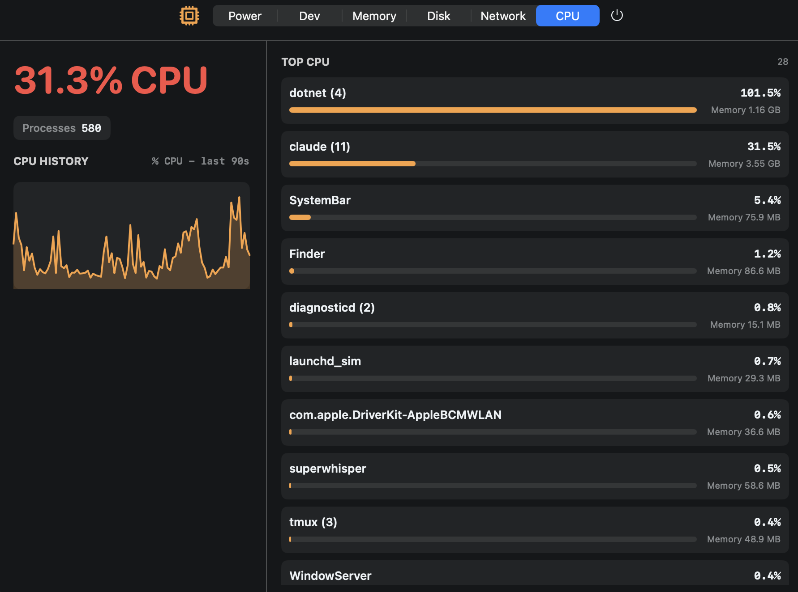

# SystemBar

A single menu bar icon for Memory, CPU, Disk, Network, and Power — instead of five separate ones.



SystemBar replaces a cluttered row of individual menu bar monitors with one icon and a tabbed popover. Tap between tabs to see memory pressure, per-process CPU share, disk usage hogs, network throughput, and battery/power state, all sampled live from macOS kernel APIs.

## The tabs

| Tab | What it shows |
|---|---|
| **CPU** | Total load, process count, a 90-second history graph, and the top processes by CPU with their memory |
| **Memory** | Pressure and its history, the wired/active/inactive/compressed/free breakdown, swap, GPU usage, and top processes by memory |
| **Disk** | Capacity, free and purgeable space per volume, Time Machine local snapshots, and reclaimable space — caches, DerivedData, Downloads — with a hint on what each is safe to do about |
| **Network** | Live up/down bandwidth, which processes are talking and where to, latency, and an on-demand speed test |
| **Power** | Battery and power source, and the sleep assertions keeping your Mac awake with their likely causes |
| **Dev** | Local dev servers and their listening ports, plus detected toolchains and integrations |

## Requirements

- **macOS 13 (Ventura) or later** — the menu bar UI is built on SwiftUI's `MenuBarExtra`, which is 13+ only
- **Xcode Command Line Tools**, for `swiftc`:
  ```bash
  xcode-select --install
  ```

There are no third-party dependencies and no package manager. `build.sh` calls `swiftc` directly on the sources.

## Build

```bash
./build.sh
```

This produces a `SystemBar` binary and a `SystemBar.app` bundle in the repo directory.

The app is **not code-signed or notarized**. Building it yourself is fine — locally compiled binaries aren't quarantined, so Gatekeeper stays out of the way. But copying the built `.app` to another Mac will trip Gatekeeper there, and rebuilding changes the binary's identity, so macOS may re-ask for any permissions you previously granted.

## Install as a login item

```bash
./install.sh
```

This builds the app, copies it to `~/Applications/SystemBar.app`, and registers a LaunchAgent that keeps it running across login.

To check what's currently installed:

```bash
./install.sh status
```

To uninstall:

```bash
./install.sh uninstall
```

## What SystemBar reads from your system

It's a system monitor, so it looks at your processes, disks, and network connections. Here is the complete list of what it runs and why — worth reading before you trust any tool like this.

Alongside direct kernel calls (`host_statistics`, `sysctl`, and friends) for CPU, memory, and interface counters, SystemBar shells out to these stock macOS utilities:

| Command | Used for | How often |
|---|---|---|
| `/bin/ps` | Process list, per-process CPU and memory | Every 10s |
| `/usr/bin/memory_pressure` | Memory pressure level | Every 30s |
| `/usr/sbin/ioreg` | GPU (`AGXAccelerator`) info | Every 30s |
| `/usr/bin/pmset` | Battery state and sleep assertions | Every 60s |
| `/usr/bin/nettop` | Per-process network throughput | Every 30s |
| `/usr/sbin/lsof` | Active TCP connections; listening ports for the Dev tab | Every 30–60s |
| `/usr/bin/tmutil` | Count of Time Machine local snapshots | Every 30s |
| `/usr/bin/du` | Sizes of known cache/junk directories for the Disk tab | Every 10 min, or on demand |
| `/usr/bin/networkQuality` | Speed test | **Only when you press the button** |

Two things worth calling out:

- **The disk scan reads directory sizes only.** It measures a fixed list of well-known space hogs (Xcode DerivedData, `~/Library/Caches`, `~/Downloads`, `~/.Trash`, npm/Cargo/Gradle/Maven/Go caches, and similar). It reads sizes, never file contents, and it never deletes anything — the hints in the UI are suggestions for you to act on yourself. Because `~/Downloads` is on the list, macOS may ask for Files and Folders permission the first time.
- **The speed test is the only thing that leaves your machine.** Pressing it runs Apple's built-in `networkQuality`, which measures throughput against Apple's servers (`mensura.cdn-apple.com`). Nothing else here sends data anywhere; every other reading is computed locally and stays on your Mac. There is no telemetry, analytics, or crash reporting.

SystemBar runs entirely as your user. It never asks for `sudo` or elevated privileges, and it launches every subprocess with an explicit executable path and argument array — never through a shell.

## Test

```bash
./test.sh
```

## Status

This is a personal project maintained casually in spare time — no guarantees on response time, but bug reports, feature requests, and pull requests are genuinely welcome.

## License

MIT — see [LICENSE](LICENSE).
